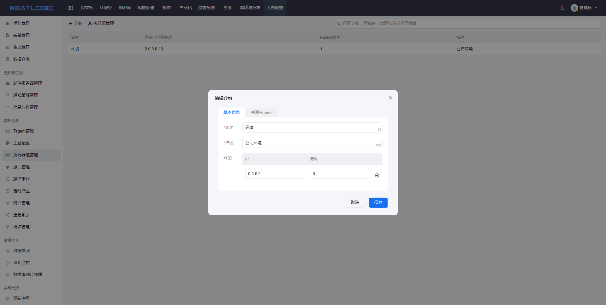
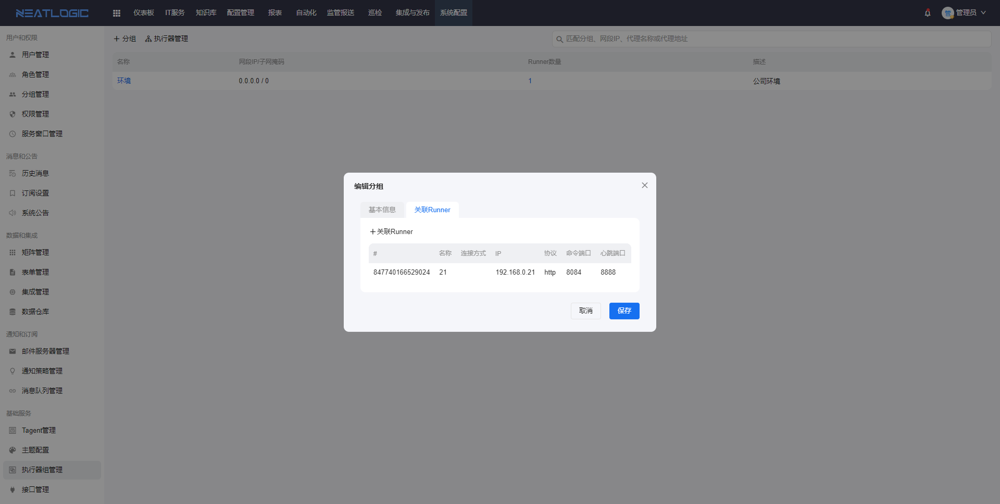
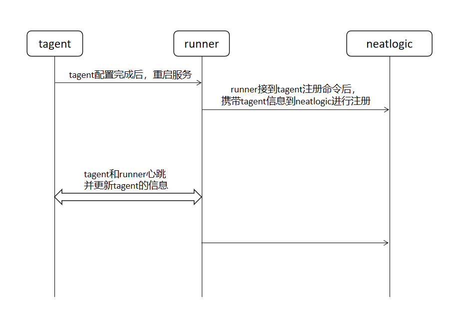
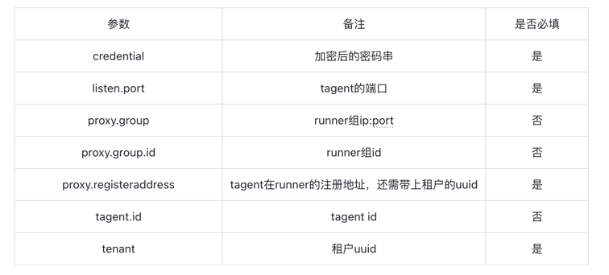

[Chinese](README.md) / English

## tagent registration

### 1、configuration
（1）tagent side configuration：<br>
Enter the '/opt/agent/run/root/conf' directory<br>
Edit the tagent.conf file<br>
Key parameter description：<br>

|          key          |                                              notes                                              | Is it mandatory |
|:---------------------:|:-----------------------------------------------------------------------------------------------:|:---------------:|
|      credential       |                                    Encrypted password string                                    |       Yes       |
|      listen.port      |                                      The port of the agent                                      |       Yes       |
|      proxy.group      |                                      Runner group ip: port                                      |       No        |
|    proxy.group.id     |                                         Runner group id                                         |       No        |
| proxy.registeraddress | The registered address of the agent in the runner must also be accompanied by the tenant's uuid |       Yes       |
|       tagent.id       |                                            tagent id                                            |       No        |
|        tenant         |                                           tenant uuid                                           |       Yes       |


Taking the installation of the tagent on 192.168.0.25, the runner on 192.168.0.21 (service port 8084, heartbeat port 8888), and the neatlogic on 192.168.0.25 (tenant test) as examples：
```
credential={ENCRYPTED}19chdeh34c738cb575fef816607
exec.timeout=900
listen.addr=0.0.0.0
listen.backlog=16
listen.port=3939
proxy.group=192.168.0.21:8888
proxy.group.id=
proxy.registeraddress=http://192.168.0.21:8084/autoexecrunner/public/api/rest/tagent/register?tenant=test
read.timeout=5
tagent.id=123
tenant=test
```
（2）neatlogic side configuration<br>
Add the runner group on the Tagent Groups management page, and the range of the network segment must include the IP address of the tagent.



### 2、Start the tagent service

**1、Start the tagent service command**
```
service tagent start
/bin/systemctl start tagent.service
```
**2、Stop the tagent service command**
```
service tagent stop
/bin/systemctl stop tagent.service 
```
### 3、Three terminal flowchart during registration


PS：<br>
（1）When registering in Neatlogic, first determine which network segment of the runner group the tagent's IP is in, match it with the runner group, and then use the runner within the group;<br>
（2）After registering the tagent on Neatlogic, if the heartbeat between the agent and the runner is normal, the agent's information will be updated to the neatlogic.<br>
（3）On the Neatlogic side, a series of operations on the agent will be executed through the runner side's command for the agent.
<br>
<br>
### 4、Logic related to ID and IP during registration

PS：<br>
（1）The containing IPs of two agents can overlap, but cannot include the main IPs of other agents. If this situation occurs during registration, an exception will be thrown [including the main IPs of other agents]<br>
（2）Find two or more agents through the main agent IP and throw an exception [the current main IP is contained by multiple agents]<br>
（3）Registration found that the agent is still connected and threw an exception [IP conflict]<br>
（4）When the ports are the same, the registered IP is included by an existing agent and is considered the same agent<br>
（5）Same IP and different ports are considered as another agent<br>
（6）When the ports are the same, each IP will correspond to a agent account. If there are overlapping IPs, each IP will only correspond to one account<br>